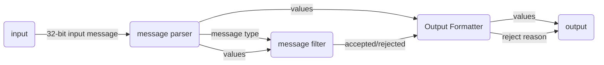

# FPGA Stream Processor


A self-directed Verilog project for simple streaming-style data processing in RTL.

The project implements a simple message processing pipeline that parses fixed-width input messages, applies filtering rules, and produces an output decision. It is a learning project about RTL design, simulation and verifying hardware designs against a software reference model.



## Current Features

- 32-bit message parser
- Simple parameterised message filter
- Output formatter for accepted/rejected messages
- Top-level RTL pipeline
- Original Verilog testbench
- `cocotb` tests using fixed input cases
- Python reference model for checking expected behaviour

## Message Format

| Bits  | Field          | Width  |
| ----- | -------------- | ------ |
| 31:28 | `message_type` | 4 bits |
| 27:24 | `channel_id`   | 4 bits |
| 23:16 | `value_a`      | 8 bits |
| 15:8  | `value_b`      | 8 bits |
| 7:0   | `flags`        | 8 bits |

## Verification

The project currently includes fixed-case and randomised cocotb tests. The cocotb randomised tests run automatically using GitHub Actions.

| File                       | Purpose                                                       |
| -------------------------- | ------------------------------------------------------------- |
| `test_direct_cases.py`     | Fixed input cases with manually specified expected outputs    |
| `test_reference_cases.py`  | Fixed input cases checked against Python reference model      |
| `test_random_reference.py` | Randomised input cases checked against Python reference model |
| `reference_model.py`       | Python software model of the expected RTL behaviour           |

Example Output:

```text
1000000.00ns INFO     test                               1000000 tests ran successfully...
1000000.00ns INFO     cocotb.regression                  test_random_reference.random_reference_cases passed

** TEST                                          STATUS  SIM TIME (ns)  REAL TIME (s)  RATIO (ns/s) **
** test_random_reference.random_reference_cases   PASS     1000000.00          25.39      39384.08  **
** TESTS=1 PASS=1 FAIL=0 SKIP=0                            1000000.00          25.40      39375.44  **
```

## Status

Working simple RTL pipeline with Verilog and cocotb verification.
A Python reference model is used to check fixed and randomised test cases against expected behaviour.
