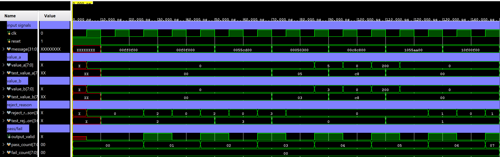

# Waveforms

This doc contains waveforms from RTL pipeline testing.

## Synchronous Pipeline Test

The waveform shows the synchronous version of the pipeline being tested with fixed input messages.

