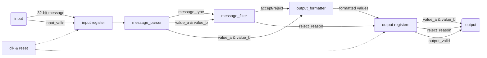

# RTL

This folder contains the Verilog design files for the project.

## Current status

The RTL implements a synchronous message-processing pipeline.

`top_pipeline.v` provides a clocked wrapper, including reset handling, input sampling, registered outputs, and `input_valid` / `output_valid` signalling.

The internal processing modules are all combinational:

- `message_parser.v` splits the 32-bit input message into seperate fields.
- `message_filter.v` checks the parsed fields and produces an accept/reject decision.
- `output_formatter.v` sets the registered output values based on the filter result.

## Message format

The current message is 32 bits wide:

| Bits  | Field          | Width  |
| ----- | -------------- | ------ |
| 31:28 | `message_type` | 4 bits |
| 27:24 | `channel_id`   | 4 bits |
| 23:16 | `value_a`      | 8 bits |
| 15:8  | `value_b`      | 8 bits |
| 7:0   | `flags`        | 8 bits |

## Rejection Reasons

| Rejection Number | Reason              |
| ---------------- | ------------------- |
| 0                | not rejected        |
| 1                | invalid type        |
| 2                | value A above limit |
| 3                | value B above limit |
